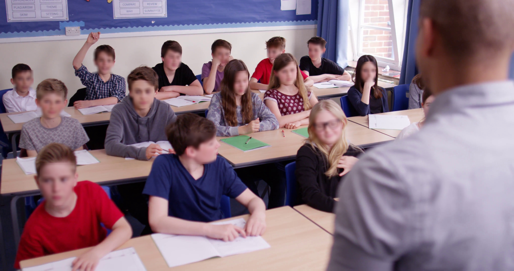
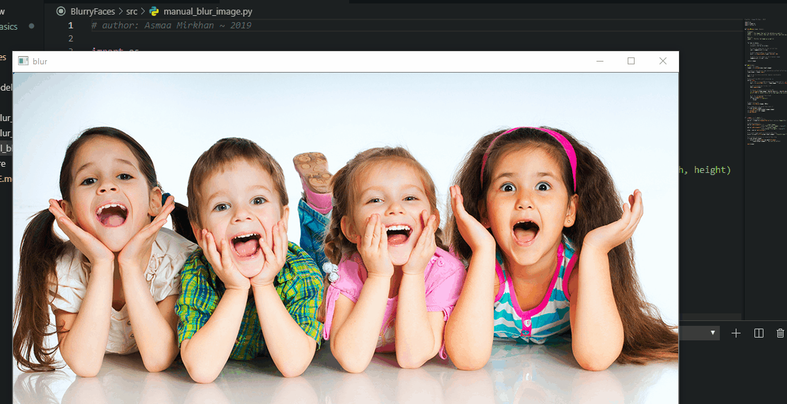

# 🕵️‍♀️ Blurry Faces
A tool to blur faces or other regions in photos and videos 🕵️‍

## 🙌 Available Codes
1. [auto_blur_image](./src/auto_blur_image.py): Detects and blurs faces _(or objects)_ in a given image automatically due to a Tensorflow model
2. [auto_blur_video](./src/auto_blur_video.py): Detects and blurs faces _(or objects)_ in a given video due to a Tensorflow model
3. [manual_blur_image](./src/manual_blur_image.py): Blurs manually selected faces _(or objects)_

> Make sure that you have OpenCV and Tensorflow already installed

## 🔧🔩 Usage 
1. Clone or download this repo
2. Open [src](/src) folder in CMD

#### For `auto_blur_image.py`:
3. Run:
   `python auto_blur_image.py --input_image C:\path\to\your\image.jpg --output_image C:\path\to\save\output.jpg  --model_path C:\path\to\your\model.pb --threshold 0.7`

#### For `auto_blur_video.py`:
3. Run:
   `python auto_blur_video.py --input_video C:\path\to\your\video.mp4 --output_video C:\path\to\save\output.mp4 --model_path C:\path\to\your\model.pb --threshold 0.7`

#### For `manual_blur_image.py`:
3. Run:
   `python manual_blur_image.py --input_image C:\path\to\your\image.jpg --output_image C:\path\to\save\output.jpg`
    * Select your ROI (Region of Interest)
    * Press <kbd>Enter</kbd>
    * Press <kbd>Q</kbd> to finish **or** any key to select another ROI

4. To see running options run _for all codes_:
   `python manual_blur_image.py --help`

5. TADAA 🎉 It's done 🤗

## 🤗 Examples

#### For `auto_blur_image.py`:

> Threshold = 0.4

#### For `auto_blur_video.py`:

> Threshold = 0.4

#### For `manual_blur_image.py`:

## 📍 Note
I am using face detection model in [face_model](./face_model) folder that can detects faces but codes are valid for every .pb object detection model

## 🐾 References 
* [Face Detection Model](https://github.com/yeephycho/tensorflow-face-detection)
* [Original Video of Imitation Game Trailer](https://www.youtube.com/watch?v=j2jRs4EAvWM)

## 💼 Contact
Find me on [LinkedIn](https://www.linkedin.com/in/asmaamirkhan/) and feel free to mail me, [Asmaa 🦋](mailto:asmaamirkhan.am@gmail.com)
